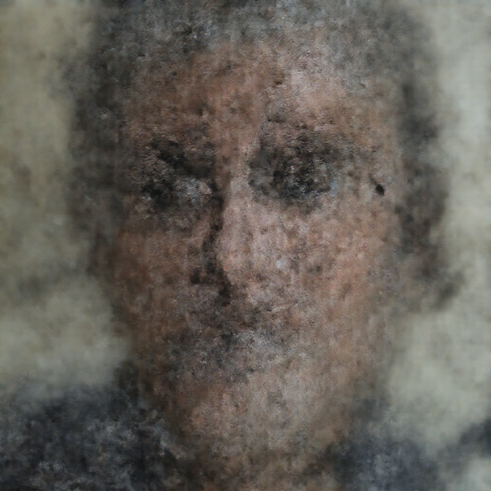
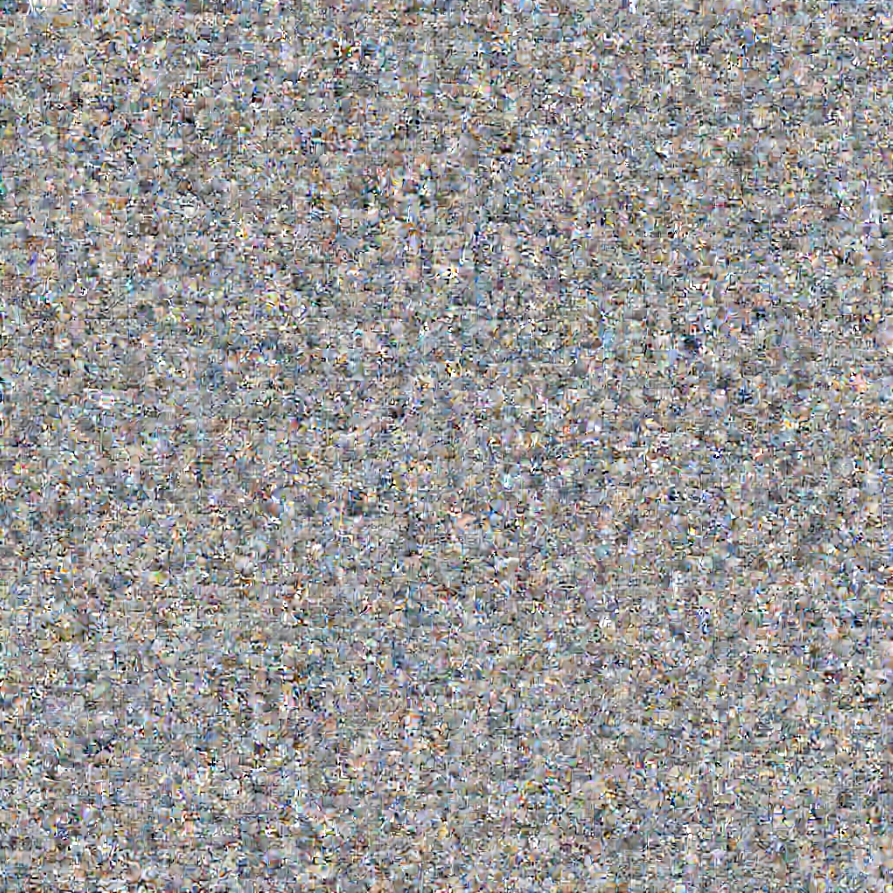
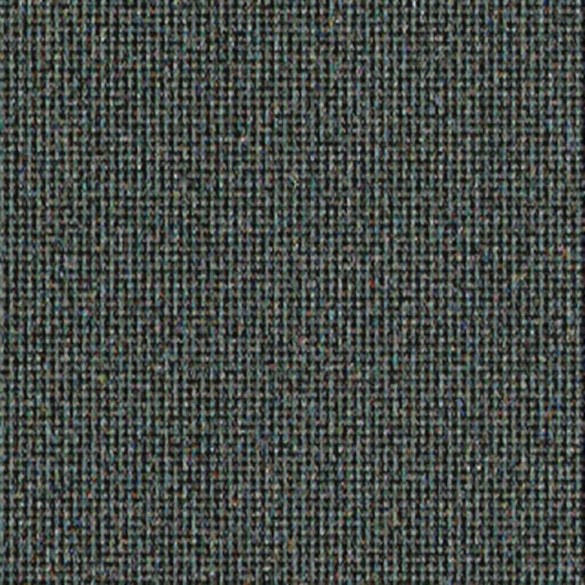
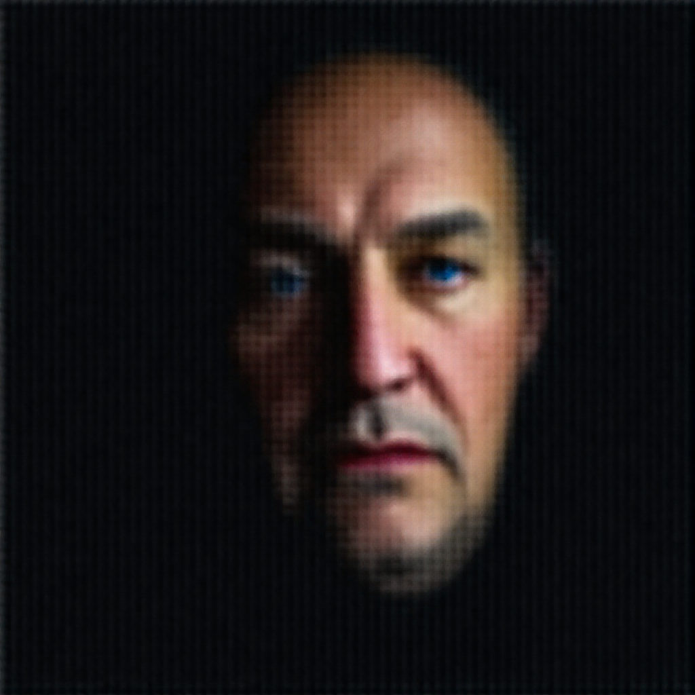
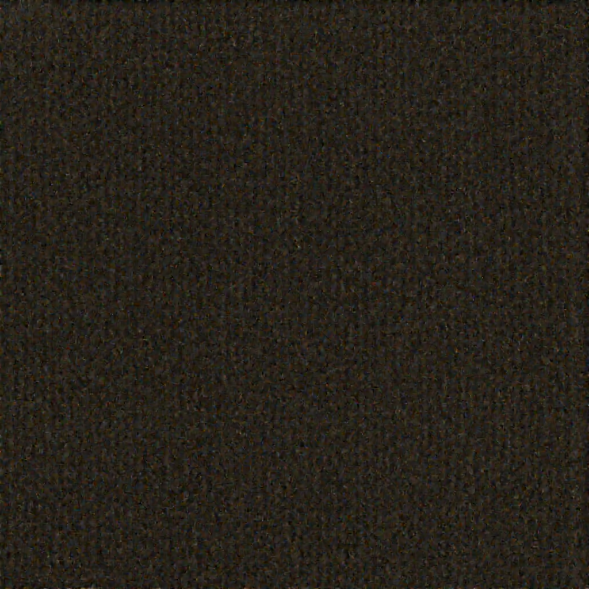

# How FLUX.1-dev dies under 1-bit binarization — an empirical probe

> **What this is:** a hands-on experiment log, not a peer-reviewed discovery. Layer
> sensitivity to quantization is already known in the literature (GPTQ, AWQ, SmoothQuant
> all show attention/outlier weights are the fragile ones). What's shown here is that
> effect **mapped end-to-end on FLUX.1-dev with a from-scratch, torch-free (numpy)
> binarizer**, judged by the only honest metric — the rendered image, not weight-space
> cosine. All runs use the same prompt + seed (old fisherman portrait, 1024², 20 steps,
> euler/simple, guidance 3.5).

## TL;DR

- **Pure 1-bit FLUX (post-training, no fine-tune) does not work.** It dies. The
  interesting part is *how* it dies, and that turns out to be structured, not random.
- There are **three orthogonal ways to kill it**, each with a distinct visual signature:
  collapse-to-mean (**void**), variance blow-up (**noise**), and loss of spatial routing
  (**tile**).
- **Attention is fragile crystal; MLP is armored concrete.** Binarizing ~12 % of weights
  (attention only) destroys the model; binarizing ~24 % (MLP only) leaves it visually
  near-perfect.
- **Weight-space cosine is a liar.** A 2-bit product-quant with cosine 0.944 renders pure
  noise, while structured Q2_K at cosine 0.95 renders cleanly. Never trust one metric —
  render the image.
- No "magic recovery island": along the *how-much-you-binarize* axis, death is monotonic.
  Life lives on a different axis — *which layers* you binarize.

## Method

Each weight matrix (of the layers being crushed) is binarized **per output channel**:

```
scale_row = mean(|W_row|)          # one fp16 scale per output neuron
W ≈ sign(W) * scale_row            # 1 bit + per-row scale
```

The largest 1–2 % of weights by magnitude are kept in fp16 (outlier protection).
Embeddings, the final layer, norms and biases are always kept fp16. The result is written
as a **dequantized fp16 "sim" checkpoint** (same trick as this repo's `*sim.safetensors`
files) so a stock ComfyUI FLUX graph can render it — the image then shows exactly the
damage of that quantization, with no custom loader needed.

## The death map

| # | What is binarized | adaLN (modulation) | Result | Image |
|---|---|---|---|---|
| **fp16** | **nothing — original 23.8 GB** | — | 🟢 **reference (gold standard)** |  |
| ref | nothing — Q2_K GGUF (2.6-bit) | — | 🟢 clean, ≈ fp16 |  |
| A | ~34 % (middle blocks) | fp16 | 🟢 clean, ≈ Q2_K |  |
| B | ~55 % (fewer blocks protected) | fp16 | 👻 ghost / mush face |  |
| C | ~72 % (all attn+mlp) | **fp16** | ⬜ smooth **void** |  |
| D | ~99 % (everything) | **1-bit** | ❄️ colour **noise** |  |
| E | attention only (~12 %) | fp16 | 🧵 woven **tile** |  |
| F | MLP only (~24 %) | fp16 | 🟢 clean fisherman |  |
| G | attn **+** MLP, double-blocks (~36 %) | fp16 | 🎭 **hybrid** — mushy face **with** a woven-mesh overlay: signatures of E **and** F superimposed (single-block attention, kept fp16, holds the composition) |  |

(For contrast, a naive **product/vector-quant at 2-bit with no per-channel structure**
renders pure noise — cosine 0.944 notwithstanding: )

## Three orthogonal axes of failure

1. **Variance → 0 (void, run C).** With adaLN/modulation kept in fp16, the residual-stream
   scale stays controlled. As the bulk is destroyed, the signal collapses toward the mean
   → a smooth, contentless field.
2. **Variance → ∞ (noise, run D).** Binarize adaLN too and the variance regulator is gone;
   the signal amplifies layer-over-layer → high-frequency colour static.
3. **Spatial routing dead (tile, run E).** Attention is the operator that mixes positions
   and breaks translation symmetry. Binarize *only* attention and the network becomes
   effectively translation-invariant → a regular repeating weave, no composition.

The same corpse, three different ways to die — controlled independently by which
subsystem you break. And they **superimpose**: run G (binarize attention *and* MLP in the
double-blocks) shows both signatures at once — a soft, degraded face (feature loss) with a
woven-mesh stamped over it (spatial loss), while the single-blocks' fp16 attention still
holds a rough composition together.

## The one finding worth keeping

**Attention ≫ MLP in binarization sensitivity.** Run E (12 % of weights, attention) is
dead; run F (24 % of weights, MLP) is clean. This is consistent with prior quantization
work (attention/qkv carry the sensitive outliers) — here it's just shown directly, in
pixels, on FLUX. It suggests bits should be spent asymmetrically: MLP can go very low,
attention must stay high.

## Honest limitations (read before getting excited)

- **This is not a compression win.** The "alive" runs keep 64–88 % of weights in fp16, so
  their *effective* bit-rate is ~10–14 bits — **fatter than Q2_K**, not smaller. The value
  here is the **sensitivity map**, not a shippable checkpoint.
- Whether a proper *sensitivity-aware* mixed quant (MLP low-bit, attention higher-bit)
  actually beats uniform **Q2_K** is **unproven** — it has to be built and A/B-rendered.
  FLUX's `single_blocks` fuse attention+MLP into one tensor, which caps how cleanly the
  asymmetry can be exploited.
- **Usable 1-bit FLUX would require training for it from scratch** (BitNet-style), not
  post-hoc quantizing an fp16 model.
- The deployable floor for this repo remains **Q2_K (~4 GB), which renders cleanly.**

## Reproducibility

Every run is: read bf16 tensor → per-channel sign-binarize (selected layers) → dequantize
→ write fp16 sim safetensors → render in ComfyUI at fixed seed. The encoder is a single
numpy script; no torch, no third-party quantization engine — same spirit as the rest of
this project.
