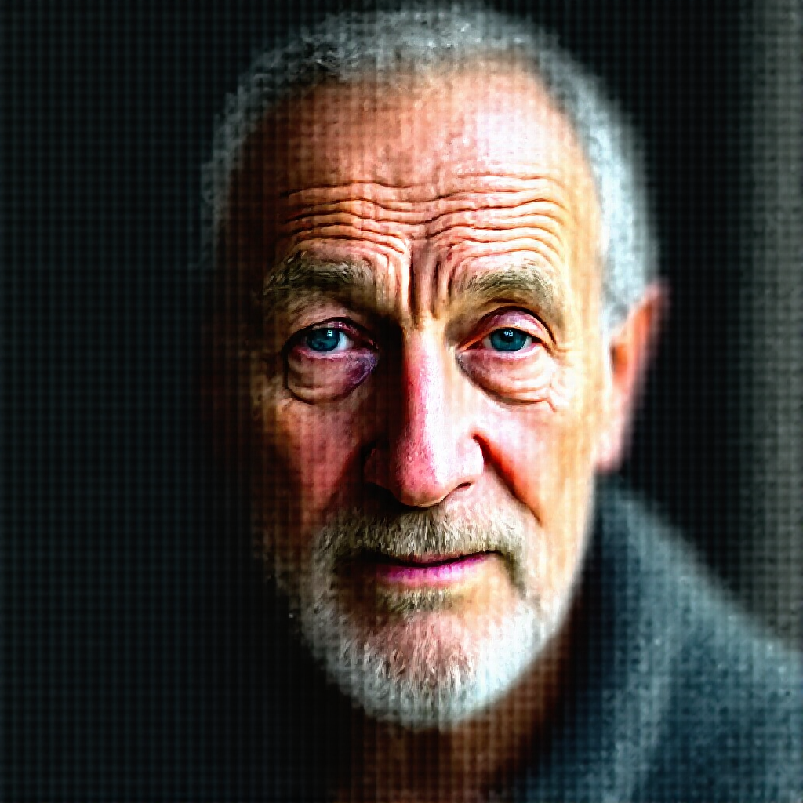
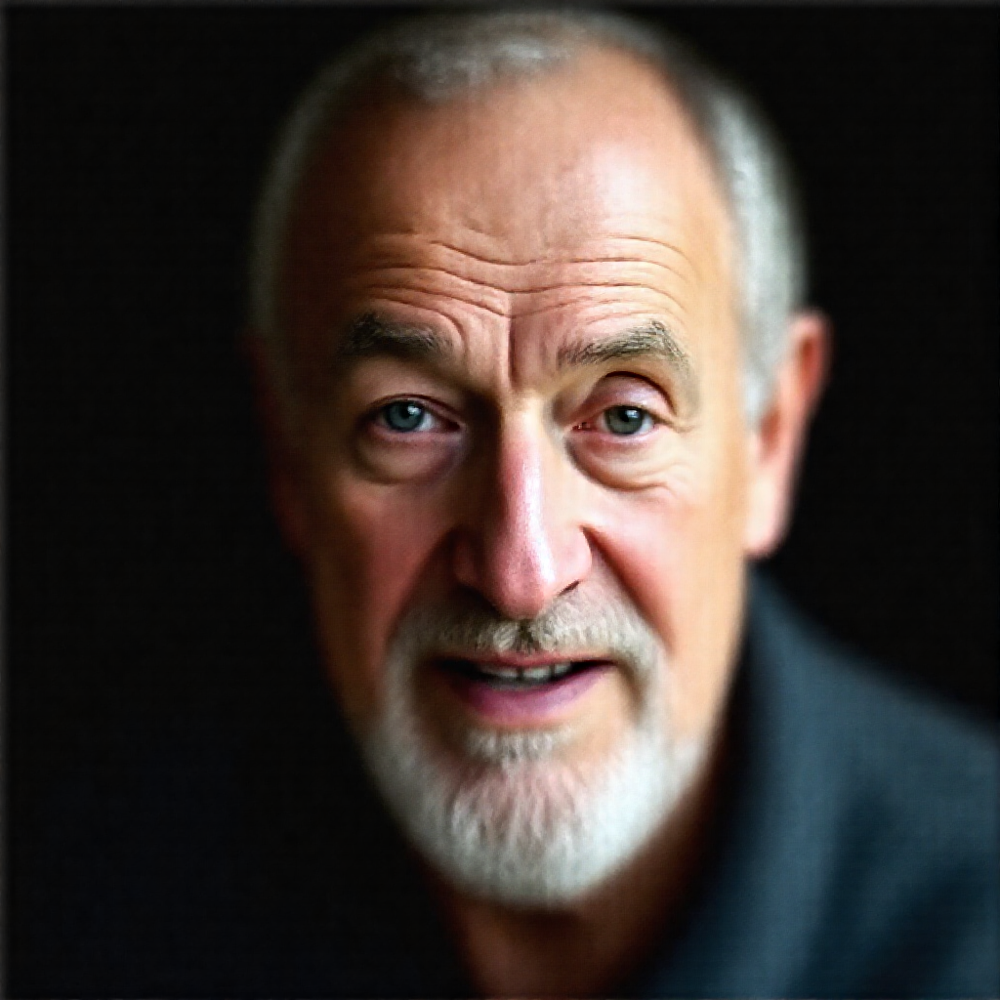
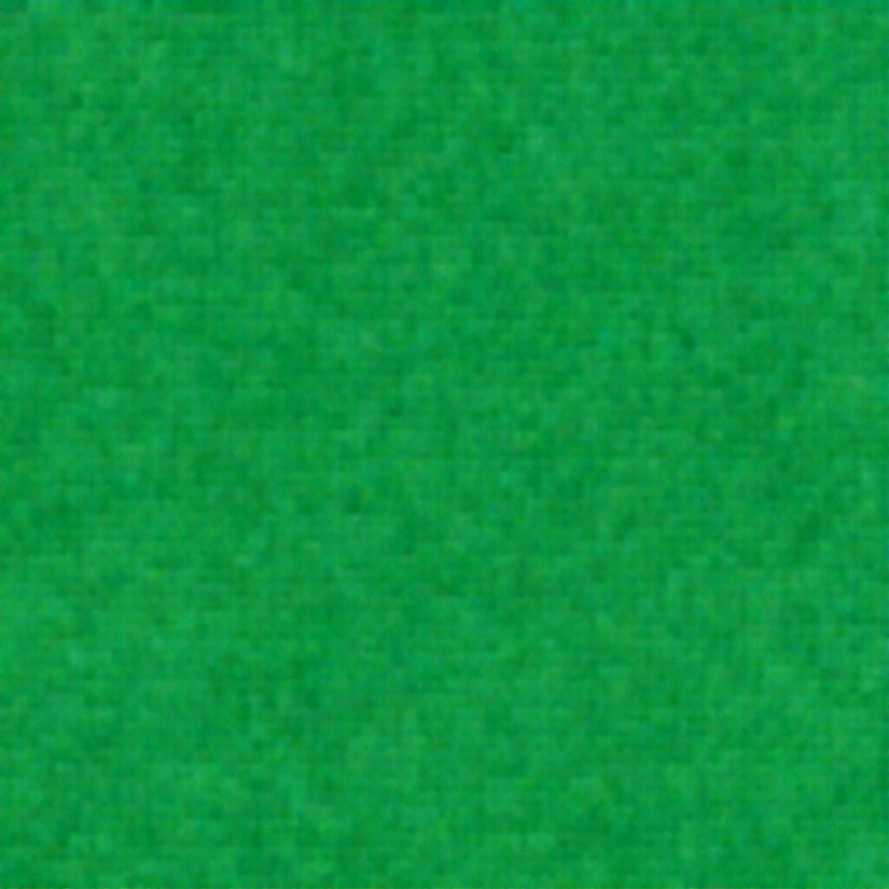

# Как FLUX.1-dev умирает при бинаризации в 1 бит — практическое расследование

[🇬🇧 English](RESEARCH-1bit-flux.md) · **🇷🇺 Русский**

> **Что это:** лог экспериментов, а не рецензируемое открытие. Чувствительность слоёв к
> квантованию уже известна в литературе (GPTQ, AWQ, SmoothQuant показывают, что
> attention/выбросы — самые хрупкие). Здесь этот эффект **снят end-to-end на FLUX.1-dev
> нашим движком с нуля (torch-free, numpy)** и судится единственной честной метрикой —
> отрендеренной картинкой, а не вес-косинусом. Все прогоны — один промпт и сид (портрет
> старика-рыбака, 1024², 20 шагов, euler/simple, guidance 3.5).

## Коротко

- **Чистый 1-бит FLUX (пост-тренировочный, без дообучения) не работает.** Умирает.
  Интересно КАК он умирает — и это оказалось структурно, а не случайно.
- Есть **три ортогональных способа его убить**, каждый со своей визуальной сигнатурой:
  схлопывание-в-среднее (**пустота**), взрыв дисперсии (**шум**), потеря пространственной
  сборки (**ткань**).
- **Attention — хрупкий хрусталь, MLP — бронированный бетон.** Бинаризация ~12% весов
  (только attention) убивает модель; ~24% (только MLP) оставляет её почти идеальной.
- **Вес-косинус — лжец.** Product-квант в 2 бита с косинусом 0.944 рендерит чистый шум, а
  структурный Q2_K при косинусе 0.95 — чисто. Никогда не верь одной метрике — рендери.
- Никакого «магического острова воскрешения»: по оси «сколько давишь» смерть монотонна.
  Жизнь живёт на другой оси — «КАКИЕ слои» бинаризуешь.
- **Хрупкий attention можно оживить, без обучения, ортогональной «коробкой»** (incoherence
  rotation, QuIP-стиль): повернуть веса, бинаризовать в повёрнутом базисе, повернуть
  обратно. Attention, ставший мёртвой тканью, возвращается **лицом**.
- **Но adaLN (modulation) — стена, которую коробка не пробивает.** Бинаризация слоёв adaLN
  — даже в коробке — схлопывает модель в ровное зелёное поле. Это проблема *магнитуд*, а
  не *выбросов*, поэтому поворот (он лечит только выбросы) её не чинит. Вот почему полный
  1-бит остаётся мёртвым: MLP и attention можно в 1-бит, а adaLN обязан быть точным.

## Метод

Каждая весовая матрица (из давимых слоёв) бинаризуется **пер-канально**:

```
scale_row = mean(|W_row|)          # одна fp16-шкала на выходной нейрон
W ≈ sign(W) * scale_row            # 1 бит + шкала на строку
```

Крупнейшие 1–2% весов по модулю держатся в fp16 (защита выбросов). Эмбеддинги, финальный
слой, нормы и биасы всегда в fp16. Результат пишется как **разжатый fp16 sim-чекпойнт**
(тот же трюк, что у `*sim.safetensors` этого репо), чтобы штатный FLUX-граф ComfyUI мог
его отрендерить — картинка тогда показывает ровно урон этого кванта, без кастомного
загрузчика.

## Карта смерти

| # | Что бинаризовано | adaLN (modulation) | Результат | Картинка |
|---|---|---|---|---|
| **fp16** | **ничего — оригинал 23.8 ГБ** | — | 🟢 **эталон** |  |
| ref | ничего — Q2_K GGUF (2.6-бит) | — | 🟢 чисто, ≈ fp16 |  |
| A | ~34% (средние блоки) | fp16 | 🟢 чисто, ≈ Q2_K |  |
| B | ~55% (меньше защищено) | fp16 | 👻 призрак/каша-лицо |  |
| C | ~72% (весь attn+mlp) | **fp16** | ⬜ гладкая **пустота** |  |
| D | ~99% (всё) | **1-бит** | ❄️ цветной **шум** |  |
| E | только attention (~12%) | fp16 | 🧵 плетёная **ткань** |  |
| F | только MLP (~24%) | fp16 | 🟢 чистое лицо |  |
| G | attn **+** MLP, double-блоки (~36%) | fp16 | 🎭 **гибрид** — мутное лицо **с** плетёнкой поверх: сигнатуры E **и** F наложены |  |

(Для контраста: наивный **product/векторный квант в 2 бита без пер-канальной структуры**
рендерит чистый шум — вопреки косинусу 0.944: )

## Три ортогональные оси провала

1. **Дисперсия → 0 (пустота, прогон C).** С adaLN/modulation в fp16 масштаб остаточного
   потока под контролем. По мере уничтожения костяка сигнал схлопывается к среднему →
   гладкое бесконтентное поле.
2. **Дисперсия → ∞ (шум, прогон D).** Забинаришь и adaLN — регулятор дисперсии пропал,
   сигнал усиливается слой-за-слоем → высокочастотный цветной снег.
3. **Пространственная сборка мертва (ткань, прогон E).** Attention — оператор, который
   смешивает позиции и ломает трансляционную симметрию. Забинаришь ТОЛЬКО attention — сеть
   становится трансляционно-инвариантной → регулярный повторяющийся узор, без композиции.

Один труп, три разных способа умереть — управляются независимо тем, какой подсистемой
ломаешь. И они **складываются**: прогон G (бинар attention *и* MLP в double-блоках)
показывает обе сигнатуры разом — мутное лицо (потеря фич) с плетёнкой поверх (потеря
пространства), а fp16-attention single-блоков ещё держит грубую композицию.

## Единственная находка, которую стоит сохранить

**Attention ≫ MLP по хрупкости к бинаризации.** Прогон E (12% весов, attention) мёртв;
прогон F (24% весов, MLP) чист. Это согласуется с прошлыми работами по квантованию
(attention/qkv несут чувствительные выбросы) — тут показано напрямую, в пикселях, на FLUX.
Значит биты надо тратить асимметрично: MLP можно очень низко, attention — держать высоко.

## Спасение: ортогональная «коробка» для хрупкого attention

Прогон E показал: attention — место, где 1-бит умирает (тяжелохвостые веса → одна per-row
шкала захвачена выбросами → смерть-ткань). Починка **без обучения**: обернуть каждый
attention-вес в ортогональный поворот *перед* бинаром и развернуть после.

```
W_eff = bin(W · R) · Rᵀ          # R = случайный ортогональный по входной оси
```

Почему работает: поворот **размазывает выбросы** — каждая повёрнутая строка есть смесь
многих весов, её распределение выравнивается к гауссу (ЦПТ), одна per-row шкала теперь
подходит *всему*, и ошибка бинара резко падает. Это ровно **incoherence processing**
(сердце QuIP / QuIP#) — без градиентов, без файн-тюна. При деплое R бесплатен для хранения
(Адамар или сид) и вшивается в активации при вычислении; для этого рендера мы храним
математически-эквивалентный эффективный вес, чтобы штатный загрузчик дал тот же результат.

| прогон | attention (те же тензоры) | результат | картинка |
|---|---|---|---|
| E | наивный пер-канальный бинар | 🧵 мёртвая **ткань** |  |
| **E-box** | **бинар внутри ортогональной коробки** | 🟢 **лицо возвращается** |  |

**Единственная** разница между ними — поворот. Те же веса, тот же 1-бит attention — коробка
и есть то, что возвращает хрупкий орган к жизни. Не пиксель-в-пиксель (остаётся слабая
сетка), но превращает *полную смерть* в *узнаваемый портрет* — а это всё, что нужно от
слоя, который нас убивал. Вместе с находкой «MLP робастный» это честный путь к
реально-низкобитному-но-живому: **MLP бинарим напрямую, attention — внутри коробки.**

## Где всё упирается: adaLN — это стена (магнитуды, не выбросы)

Attention спасён, MLP и так робастен — очевидный следующий шаг давить в *полный* 1-бит,
забинарить всё, включая слои **adaLN / modulation** (~27% весов FLUX). Не выходит. Любая
конфигурация, которая бинаризует adaLN — наивно или в коробке, отдельно или вместе с
single-блоками — рендерит **одно и то же ровное зелёное поле**. Ни контента, ни лица.

| прогон | что бинаризовано | результат | картинка |
|---|---|---|---|
| Q1 (живой) | MLP + attention (коробка), **adaLN в fp16** | 🟢 чистое лицо |  |
| adaLN в коробке | adaLN + single-блоки (adaLN боксед) | 🟩 мёртвое **зелёное поле** |  |

Почему коробка здесь бессильна, хотя спасла attention: attention умирал от **выбросов** —
пара огромных весов захватывала per-row шкалу — их поворот размазывает. adaLN умирает от
**потери точности магнитуд**. Его выходы — это per-token масштаб/сдвиг, напрямую умножающие
остаточный поток, им нужны точные *значения*, а не просто ровное распределение. Бинар в
`±scale` выбрасывает точные магнитуды, а коробка лишь переформовывает распределение —
вернуть величины она не может. Другой класс поломки, поворотом не чинится.

**Так что потолок конкретен:** MLP → 1-бит, attention → 1-бит-в-коробке, но **adaLN обязан
быть точным.** Это ограничивает пост-тренировочный FLUX смешанным эффективным битрейтом
(грубо Q2-и-выше при правильной упаковке), а не честным равномерным 1-битом. Загнать adaLN
в 1-бит можно только обучив модель под это (BitNet-стиль) — вне рамок пост-хок квантайзера.

## Честные ограничения (прочти, прежде чем радоваться)

- **Это НЕ победа по сжатию.** «Живые» прогоны держат 64–88% весов в fp16, так что их
  *эффективный* битрейт ~10–14 бит — **жирнее Q2_K**, не меньше. Ценность здесь — **карта
  хрупкости**, а не готовый чекпойнт.
- Побьёт ли толковый *sensitivity-aware* смешанный квант (MLP низко, attention выше)
  равномерный **Q2_K** — **не доказано**, надо собрать и сравнить рендером. В FLUX
  `single_blocks` сливают attention+MLP в один тензор, что ограничивает, насколько чисто
  можно использовать асимметрию.
- **Рабочий 1-бит FLUX требовал бы обучения под него** (BitNet-стиль), а не пост-хок кванта
  fp16-модели.
- Деплой-дно для этого репо остаётся **Q2_K (~4 ГБ), рендерит чисто.**

## Воспроизводимость

Каждый прогон: читаем bf16-тензор → пер-канальный sign-бинар (выбранные слои) → разжимаем →
пишем fp16 sim-safetensors → рендерим в ComfyUI на фиксированном сиде. Энкодер — один
numpy-скрипт; ни torch, ни чужого квант-движка — в духе всего проекта.
